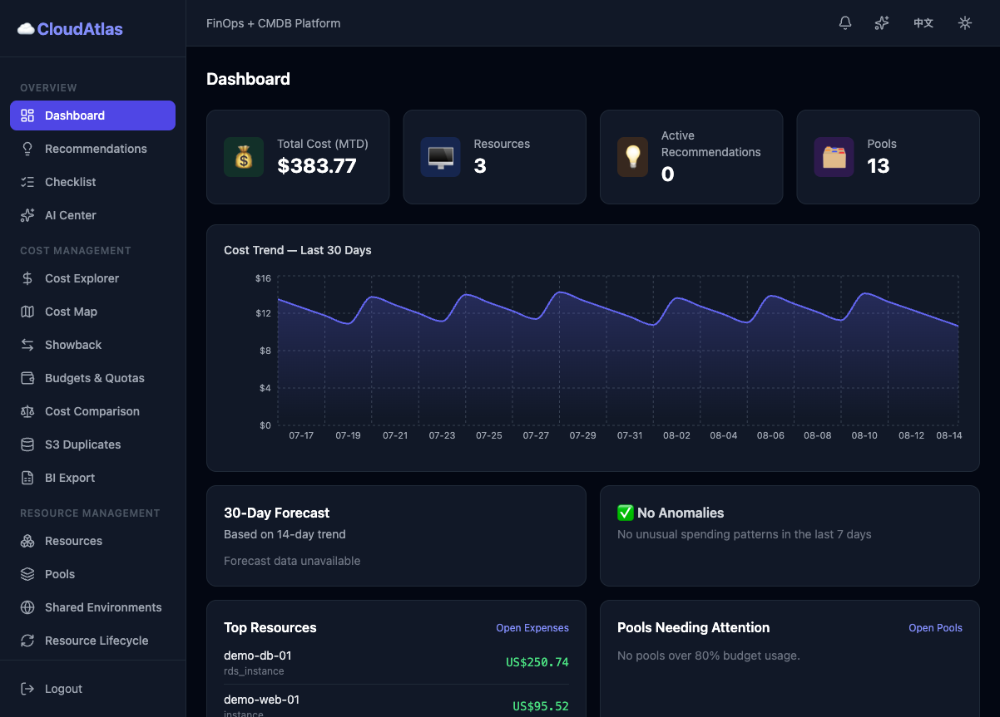
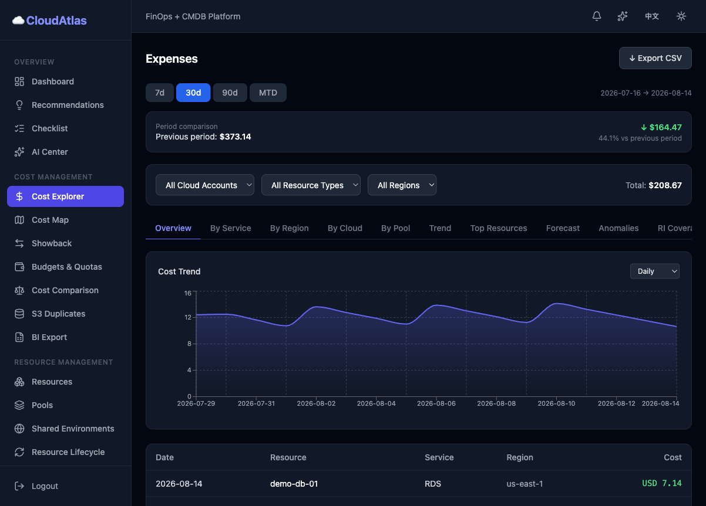
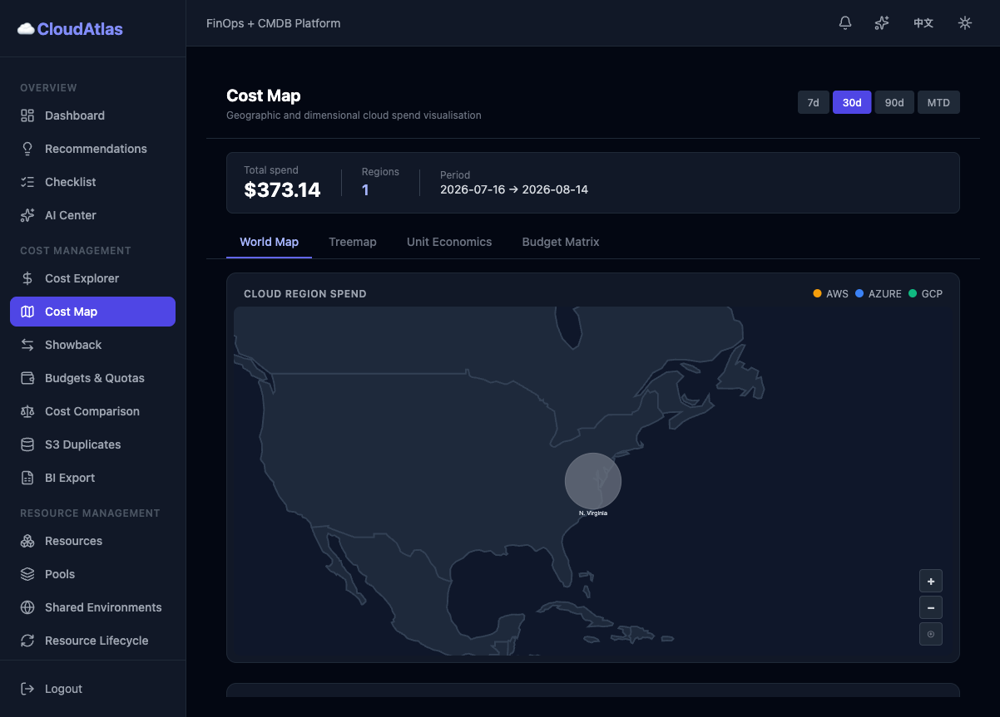
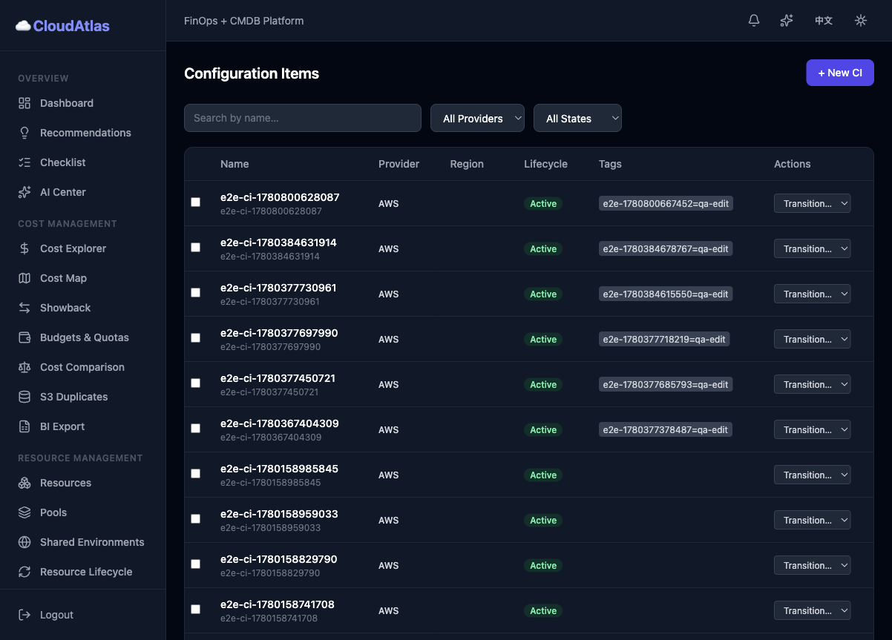
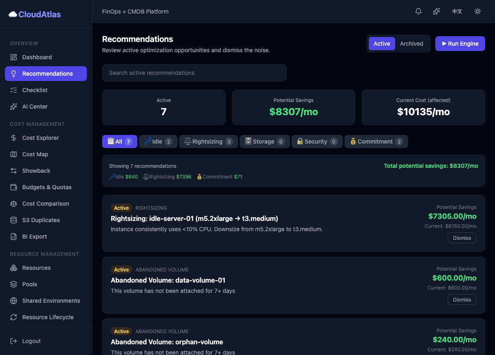
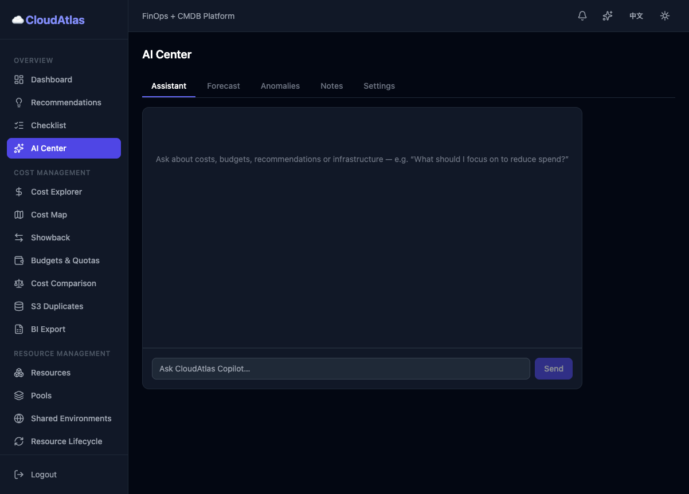
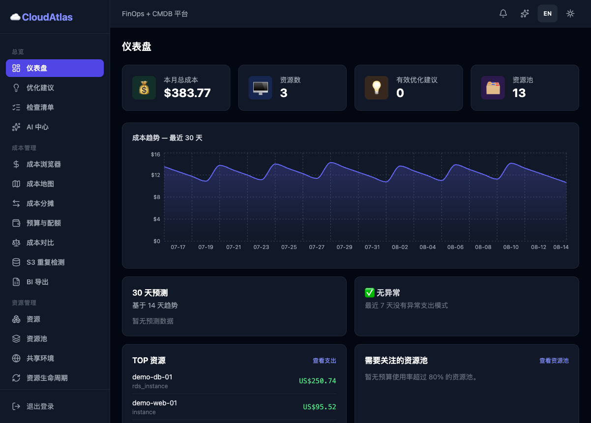
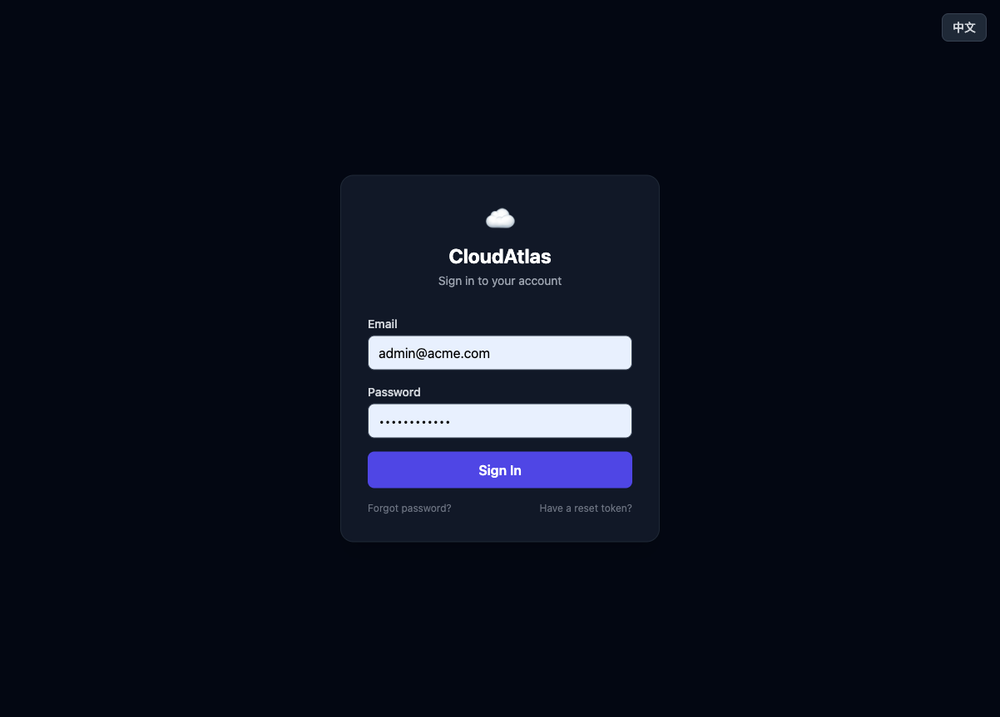

<div align="center">

# ☁️ CloudAtlas

### Unified FinOps + CMDB Platform

**Manage cloud costs and infrastructure assets from a single pane of glass.**

[](https://github.com/GOODBOY008/cloudatlas/actions/workflows/ci.yml)
[](LICENSE)
[](backend/Cargo.toml)
[](frontend/package.json)
[](backend/migrations)

[Quick Start](#-quick-start) · [Features](#-features) · [Architecture](#-architecture) · [Docs](docs/) · [Contributing](CONTRIBUTING.md)

</div>

---

## 📖 Overview

CloudAtlas is an open-source platform that unifies **FinOps cost optimization** and **CMDB asset management** into a single, self-hosted application. It gives engineering teams full visibility into cloud spend and infrastructure topology — without the complexity of managing multiple tools.

Built with a **Rust (Axum) backend** and a **React + TypeScript frontend**, backed exclusively by **PostgreSQL** — no Redis, Kafka, or Elasticsearch required.

The UI is fully bilingual — **English / 中文** — switchable at any time from the header (language, dark/light theme), including on the pre-auth screens.

---

## 📸 Screenshots

| | |
|---|---|
|  |  |
|  |  |
|  |  |
|  |  |

*Dashboard, Cost Explorer, Cost Map, CMDB, Recommendations, AI Center (EN) and Dashboard (中文) — dark mode, seeded demo data.*

---

## ✨ Features

### FinOps — Cloud Cost Management

| Feature | Description |
|---------|-------------|
| 🏦 **Multi-Cloud Billing** | Ingest billing from AWS, Alibaba Cloud, and mock providers |
| 💰 **Cost Pools & Budgets** | Hierarchical resource pools with budget tracking and alerts |
| 📊 **Cost Map** | Treemap, world map, unit economics, and budget matrix views |
| 📈 **Forecasting** | 14-point linear regression 30-day spend projections |
| 🏷️ **Tagging Policies** | Tag enforcement and cost allocation by tag |
| 🧾 **Showback / Chargeback** | Cost allocation reports by pool and business capability |
| 📅 **Power Schedules** | Automated start/stop schedules for idle resource savings |
| 🎯 **Recommendations** | 25+ detection modules: idle, orphan, rightsizing, RI/savings-plan coverage, security — with savings estimates |
| ⚠️ **Anomaly Detection** | Rolling-baseline spend anomaly alerts |
| 🪣 **S3 Duplicates** | Similar/duplicate bucket detection with cleanup savings estimate |
| 📤 **BI Export** | Recurring CSV/JSON exports of expenses, resources, and recommendations for external BI tools |
| 🧮 **Cost Comparison** | Side-by-side period comparison by service, region, cloud, or pool |

### CMDB — Infrastructure Asset Management

| Feature | Description |
|---------|-------------|
| 🗄️ **CI Registry** | Metadata-driven Configuration Item types with dynamic attributes |
| 🔗 **Relationship System** | Three-tier associations: kind → schema → instance |
| 🔄 **Lifecycle Tracking** | State machine transitions with full history log |
| 📜 **Audit Trail** | Polymorphic audit log with pre/post data diff |
| 🌐 **Topology & Impact** | BFS recursive impact analysis with configurable depth |
| 📐 **Dynamic Groups** | Saved filters with on-demand execution |
| 🛡️ **Compliance** | Baseline drift detection and compliance policy enforcement |
| 🔄 **Drift Detection** | Capture CI baselines and detect configuration drift with old→new diffs |
| 🔌 **Service Mapping** | Application/service to CI mapping for business context |
| 🌍 **External CMDB** | Connect external CMDB systems (ServiceNow, REST, Jira) with CI discovery |

### AI & Intelligence

| Feature | Description |
|---------|-------------|
| 🤖 **AI Assistant** | Chat assistant grounded in your cost & inventory data (OpenAI-compatible LLM) |
| 📈 **AI Forecast** | LLM-assisted spend forecasting on top of trend regression |
| 🚨 **AI Anomalies** | Statistical anomaly explanations with z-scores and direction |
| 📚 **RAG Knowledge Base** | Notes with semantic (embedding) and keyword search |
| ✅ **Adoption Checklist** | Toggle the 25+ recommendation modules on/off and tune thresholds |

### Platform

| Feature | Description |
|---------|-------------|
| 🔐 **RBAC** | Multi-tenant orgs with 5 roles: owner, admin, finops, cmdb_editor, viewer |
| 🔑 **JWT Auth** | Access + refresh token pair (HS256) with Argon2id password hashing |
| 📅 **Scheduler** | Background cloud sync, billing import, alert checks, webhook delivery |
| 🔔 **Webhooks & Integrations** | Event-driven notifications with configurable retry; Slack etc. integration cards with test delivery |
| 📖 **OpenAPI** | Auto-generated Swagger UI at `/swagger-ui/` |
| 🐳 **Docker-first** | `docker compose up` and you're running |
| 🌙 **Dark / Light Mode** | Persistent theme toggle with Tailwind CSS |
| 🌐 **Bilingual UI** | Full English / 中文 interface — every page, both themes, pre-auth screens included |

---

## 🚀 Quick Start

> Full setup with verification steps and troubleshooting: **[docs/quickstart.md](docs/quickstart.md)**

```bash
# 1. Clone the repository
git clone https://github.com/GOODBOY008/cloudatlas.git
cd cloudatlas

# 2. Configure environment (optional for a local first run — the compose file
#    ships self-contained dev defaults; required for production)
cp .env.example .env
# Edit .env — at minimum, change JWT_SECRET and ENCRYPTION_KEY for production

# 3. Start everything (PostgreSQL + migrations + API + frontend)
docker compose up

# 4. Access the platform
#    Frontend:    http://localhost:3000
#    API:         http://localhost:8080/api/v1
#    Swagger UI:  http://localhost:8080/swagger-ui/
#    Health:      http://localhost:8080/health
```

**Seed credentials** (from `007_seed.sql` — demo org **Acme Corp**):

| User | Email | Password |
|------|-------|----------|
| Admin | `admin@acme.com` | `Password123!` |
| Alice (member) | `alice@acme.com` | `Password123!` |
| Bob (member) | `bob@acme.com` | `Password123!` |

> The seed data includes 2 mock cloud accounts, discovered resources, 30+ days of expenses, pools, and recommendations — enough to explore every page without connecting a real cloud.

**First five minutes — a quick tour:**

1. **Dashboard** — total MTD cost, 30-day trend, forecast, top resources, pools needing attention
2. **Recommendations** — click **Run Engine**, then browse findings with estimated savings
3. **Cost Explorer** — slice spend by service / region / cloud / tag, drill into any resource
4. **Cost Map** — treemap, world map, unit economics, budget matrix
5. **CMDB** — browse configuration items, open one for topology, audit trail, and linked costs

Prefer videos to reading? The [User Guide](docs/user-guide.md) walks through every page step by step.

---

## 🛠️ Development

### Prerequisites

| Tool | Version | Purpose |
|------|---------|---------|
| [Rust](https://rustup.rs/) | 1.78+ | Backend compiler |
| [Node.js](https://nodejs.org/) | 20+ | Frontend build |
| [Docker](https://docs.docker.com/get-docker/) | 24+ | Container runtime |
| [cargo-watch](https://crates.io/crates/cargo-watch) | latest | Backend hot reload |
| [sqlx-cli](https://crates.io/crates/sqlx-cli) | latest | Database migrations |

### First-Time Setup

```bash
make setup          # Creates .env, installs npm deps, installs cargo-watch + sqlx-cli
make dev            # Full dev stack: PostgreSQL + cargo-watch + Vite (hot reload)
```

### Make Commands

```bash
# Development
make dev              # Full dev stack with hot-reload
make dev-db           # Start only PostgreSQL
make dev-backend      # Run backend with cargo-watch
make dev-frontend     # Run Vite dev server only

# Build & Test
make build            # Build backend + frontend
make test             # Run all tests (Rust + TypeScript)
make lint             # Clippy + ESLint
make fmt              # Format all code (rustfmt + prettier)

# Database
make migrate          # Run pending migrations
make migrate-status   # Show migration status
make seed             # Load sample data
make reset-db         # Drop, recreate, migrate, seed

# Docker
make docker-up        # Start production stack
make docker-down      # Stop production stack
make docker-build     # Build all Docker images
make docker-logs      # Tail container logs

# Utilities
make api-test         # Run API smoke tests against running server
make env-check        # Validate environment variables
make gen-secret       # Generate a secure random JWT secret
make help             # Show all available commands
```

### Running Tests

```bash
# Backend tests (requires PostgreSQL)
cd backend && cargo test

# Run specific test suite
cargo test --test cmdb_tests
cargo test --test auth_tests
cargo test --test expense_tests

# Frontend type check
cd frontend && npm run build
```

### List Pagination (unified envelope)

Every paginated list endpoint accepts `?page=1&per_page=50` (1-based; `per_page`
clamped to `[1, 200]`, sole exception `GET /metrics` → max 2000) and returns:

```json
{
  "data": [ /* one page of rows */ ],
  "meta": { "total": 1234, "page": 2, "per_page": 50, "total_pages": 25,
            "limit": 50, "offset": 50 }
}
```

`limit`/`offset` remain accepted as deprecated aliases (`page = offset/limit + 1`);
`meta.total` always comes from a real `COUNT(*)` under the same filters, and a page
beyond the last returns `data: []` with the true `total` — never an error.
Full design: `docs/superpowers/specs/2026-09-10-list-pagination-design.md`.

---

## 🏗️ Architecture

```
┌─────────────────────────────────────────────────────────────────┐
│                         Browser / Client                        │
│                   React 18 · TypeScript · Vite                  │
│            Zustand · React Query · Recharts · Tailwind          │
└──────────────────────────────┬──────────────────────────────────┘
                               │  HTTP / REST
                               ▼
┌─────────────────────────────────────────────────────────────────┐
│                        Axum HTTP Server                         │
│              JWT Middleware · RBAC · CORS · tracing             │
├──────────┬──────────┬──────────┬──────────┬─────────────────────┤
│   auth   │  cloud   │   cmdb   │ expense  │  recommendation     │
│          │          │          │          │  alert · webhook     │
│          │          │          │          │  tagging · rules     │
│          │          │          │          │  constraints         │
│          │          │          │          │  power_schedule      │
├──────────┴──────────┴──────────┴──────────┴─────────────────────┤
│                       Background Scheduler                      │
│        cloud sync · rec engine · alert eval · webhook push      │
├─────────────────────────────────────────────────────────────────┤
│                       PostgreSQL 15+ (only)                     │
│     JSONB · CTE · Window Functions · Recursive Traversals       │
└─────────────────────────────────────────────────────────────────┘
```

**Design decisions** are documented in [Architecture Decision Records](docs/adr/):
- [ADR-001](docs/adr/ADR-001-modular-monolith.md) — Modular monolith over microservices
- [ADR-002](docs/adr/ADR-002-postgresql-only.md) — PostgreSQL as the only data store
- [ADR-003](docs/adr/ADR-003-rust-axum.md) — Rust + Axum for the API layer

See [docs/design.md](docs/design.md) for the full architecture document.

---

## 📁 Project Structure

```
cloudatlas/
├── backend/                  # Rust Axum application
│   ├── src/
│   │   ├── modules/          # Domain modules
│   │   │   ├── auth/         #   Registration, login, JWT, orgs, RBAC
│   │   │   ├── cloud/        #   Cloud accounts, adapters (AWS/Aliyun/Mock), FX rates
│   │   │   ├── billing/      #   AWS CUR + Aliyun BSS billing ingestion
│   │   │   ├── expense/      #   Expenses, pools, cost map, showback
│   │   │   ├── resources/    #   Unified resource inventory
│   │   │   ├── cmdb/         #   CI types, CIs, associations, services, drift, external CMDB
│   │   │   ├── recommendation/ #  FinOps recommendation engine (25+ modules)
│   │   │   ├── ai/           #   AI assistant, forecast, anomalies, RAG notes
│   │   │   ├── alert/        #   Budget alerts, evaluation
│   │   │   ├── constraints/  #   Anomaly / count / spend constraints
│   │   │   ├── bi_export/    #   Recurring BI exports (CSV/JSON)
│   │   │   ├── integrations/ #   Third-party integrations (Slack, ...)
│   │   │   ├── webhook/      #   Webhook registry, delivery
│   │   │   ├── tagging/      #   Tag policies, coverage
│   │   │   ├── rules/        #   Assignment rules
│   │   │   ├── k8s/          #   Kubernetes rightsizing
│   │   │   ├── shared_env/   #   Shared environment booking
│   │   │   ├── lifecycle/    #   TTL / idle-shutdown policies
│   │   │   ├── power_schedule/ #  Resource power scheduling
│   │   │   └── scheduler/    #   Background job runner
│   │   ├── middleware/       # JWT auth, RBAC, CORS, logging
│   │   ├── routes.rs         # Router + OpenAPI aggregation
│   │   └── main.rs           # Entry point
│   ├── migrations/           # SQL migration files (001–026)
│   └── tests/                # Integration tests
├── frontend/                 # React + TypeScript SPA
│   └── src/
│       ├── pages/            # 45+ pages: Dashboard, Expenses, CostMap, CMDB,
│       │                     #   Recommendations, AI Center, BI Export, ...
│       ├── components/       # Shared UI (Layout, GlobalSearch, common widgets)
│       ├── store/            # Zustand stores (auth, theme, org)
│       ├── i18n/             # react-i18next locales (en, zh)
│       ├── lib/              # API client, auth helpers
│       └── types/            # TypeScript interfaces
├── docker/                   # Dockerfiles (backend, frontend, migrate)
├── e2e/                      # Playwright end-to-end tests
├── scripts/                  # Helper scripts (smoke_test, check_env)
├── docs/                     # Design docs, ADRs, guides
├── .github/                  # CI/CD workflows, issue templates
├── docker-compose.yml        # Production compose stack
├── docker-compose.dev.yml    # Dev compose with hot reload
└── Makefile                  # Task runner (make help)
```

---

## ⚙️ Configuration

All configuration is via environment variables. Copy `.env.example` to `.env`:

| Variable | Required | Description |
|----------|----------|-------------|
| `DATABASE_URL` | ✅ | PostgreSQL connection string |
| `JWT_SECRET` | ✅ | HMAC-SHA256 secret (min 32 chars; use `make gen-secret`) |
| `ENCRYPTION_KEY` | ✅ | AES-256-GCM key for cloud credentials (64 hex chars) |
| `APP_ENV` | | `development` / `staging` / `production` |
| `APP_PORT` | | API port (default `8080`) |
| `RUST_LOG` | | Log filter (`info,cloudatlas=debug`) |
| `CLOUD_MOCK_ENABLED` | | Use mock cloud adapter for local dev (`true`) |
| `SCHEDULER_ENABLED` | | Enable background job runner (`true`) |
| `CORS_ALLOWED_ORIGINS` | | Comma-separated allowed origins |
| `AI_ENABLED` | | Enable AI/LLM features (requires `OPENAI_API_KEY`) |

See [`.env.example`](.env.example) for the complete reference with defaults.

---

## 📚 Documentation

| Document | What's inside |
|----------|---------------|
| [Quickstart](docs/quickstart.md) | From clone to running platform — Docker or dev setup, verification, first tour |
| [User Guide](docs/user-guide.md) | Page-by-page walkthrough of all 45+ pages — the best place to start |
| [Architecture Design](docs/design.md) | Full technical design: data model, modules, scheduler |
| [ADR Index](docs/adr/) | Architecture Decision Records (modular monolith, PostgreSQL-only, Rust/Axum, ...) |
| [API Examples](docs/api-examples.md) | Copy-paste `curl` recipes for common workflows |
| [Production Checklist](docs/production-checklist.md) | Hardening steps before going live |
| [Backup & Restore](docs/backup-restore.md) | Database backup strategy |
| [CI/CD](docs/ci-cd.md) | Pipeline setup |

Once running, interactive API docs are available at:

| Endpoint | URL |
|----------|-----|
| **Swagger UI** | `http://localhost:8080/swagger-ui/` |
| **OpenAPI JSON** | `http://localhost:8080/api-docs/openapi.json` |
| **Health check** | `http://localhost:8080/health` |
| **Readiness** | `http://localhost:8080/health/ready` |

All endpoints are prefixed with `/api/v1` and require a valid JWT bearer token (except `/auth/login`, `/auth/register`, and health endpoints).

---

## 🚢 Deployment

### Docker Compose (Production)

```bash
# Build and start all services
docker compose up -d --build

# View logs
docker compose logs -f api

# Update images
./scripts/update_images.sh --restart
```

### Kubernetes / Helm

CloudAtlas can be deployed to Kubernetes using the Docker images built from `docker/backend.Dockerfile` and `docker/frontend.Dockerfile`. A Helm chart is on the roadmap.

### Environment Checklist for Production

- [ ] Set a strong `JWT_SECRET` (use `make gen-secret`)
- [ ] Set a real `ENCRYPTION_KEY` (64 random hex chars)
- [ ] Point `DATABASE_URL` to a managed PostgreSQL instance
- [ ] Set `APP_ENV=production`
- [ ] Disable `CLOUD_MOCK_ENABLED` and configure real cloud credentials
- [ ] Restrict `CORS_ALLOWED_ORIGINS` to your domain(s)
- [ ] Configure TLS termination (nginx / load balancer)

---

## 🤝 Contributing

We welcome contributions! Please see [CONTRIBUTING.md](CONTRIBUTING.md) for:

- Development setup and workflow
- Coding standards (Rust + TypeScript)
- Pull request process
- Issue reporting guidelines

By participating in this project, you agree to abide by our [Code of Conduct](CODE_OF_CONDUCT.md).

---

## 📄 License

CloudAtlas is licensed under the [Apache License 2.0](LICENSE).

```
Copyright 2026 CloudAtlas Contributors

Licensed under the Apache License, Version 2.0 (the "License");
you may not use this file except in compliance with the License.
You may obtain a copy of the License at

    http://www.apache.org/licenses/LICENSE-2.0
```

---

<div align="center">

**If CloudAtlas is useful to you, please consider giving it a ⭐**

[Report a Bug](https://github.com/GOODBOY008/cloudatlas/issues/new?template=bug_report.md) · [Request a Feature](https://github.com/GOODBOY008/cloudatlas/issues/new?template=feature_request.md)

</div>
